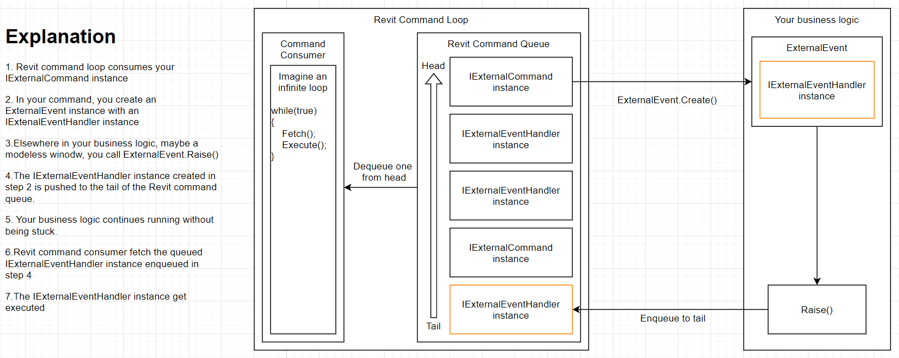
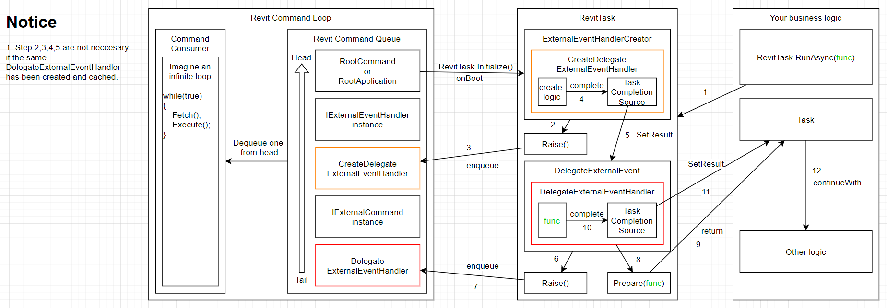

# Revit.Async
Use Task-based asynchronous pattern (TAP) to run Revit API code from any execution context.

[中文说明](说明.md)

[](https://www.nuget.org/packages/Revit.Async/)
# Background

If you have ever encountered a Revit API exception saying, "Cannot execute Revit API outside of Revit API context",
typically when you want to execute Revit API code from a modeless window, you may need this library to save your life.

A common solution for this exception is to wrap the Revit API code using `IExternalEventHandler` and register the handler instance to Revit ahead of time to get a trigger (`ExternalEvent`).
To execute the handler, just raise the trigger from anywhere to queue the handler to the Revit command loop.
But there comes another problem.
After raising the trigger, within the same context, you have no idea when the handler will be executed and it's not easy to get some result generated from that handler.
If you do want to make this happen, you have to manually yield the control back to the calling context.

This solution looks quite similar to the mechanism of "Promise" if you are familiar with JavaScript ES6.
Actually, we can achieve all the above logic by making use of task-based asynchronous pattern (TAP) which is generally known as `Task<T>` in .NET.
By adopting Revit.Async, it is possible to run Revit API code from any context, because internally Revit.Async wraps your code automatically with `IExternalEventHandler` and yields the return value to the calling context to make your invocation more natural.

If you are unfamiliar with the task-based asynchronous pattern (TAP), here is some useful material on it provided by Microsoft:

- [Task-based asynchronous pattern (TAP)
](https://docs.microsoft.com/en-us/dotnet/standard/asynchronous-programming-patterns/task-based-asynchronous-pattern-tap)
- [Task asynchronous programming model](https://docs.microsoft.com/en-us/dotnet/csharp/programming-guide/concepts/async/task-asynchronous-programming-model)

Here is a [diagram comparing the Revit API external event mechanism with Revit.Async](https://drive.google.com/file/d/1sb6Yrlt6zjkE9XBh4UB5sWV_i8nTpkmG/view?usp=sharing) and
screenshots of the two main parts:

## Revit API External Event



## Revit.Async


# Revit.Async and Multithread
I was frequently asked about whether Revit.Async runs Revit API in a background thread.

Let's clarify it. The answer is **NO!!!!!** Don't be misled by the word "Async".

The word "Async" is actually innocent here. It is .NET who names a bunch of multithread methods with "Async" ending that results in the general misunderstanding.

This question can be explained starting from the differences between Asynchronous Programming and Multithread Programming.

A word from [stackoverflow](https://stackoverflow.com/a/34681101/12922826):

> "Threading is about workers; asynchrony is about tasks".

An analogy from the same stackoverflow answer:

> You are cooking in a restaurant. An order comes in for eggs and toast.
> 
> Synchronous: you cook the eggs, then you cook the toast.
> 
> Asynchronous, single threaded: you start the eggs cooking and set a timer. You start the toast cooking, and set a timer. While they are both cooking, you clean the kitchen. When the timers go off you take the eggs off the heat and the toast out of the toaster and serve them.
> 
> Asynchronous, multithreaded: you hire two more cooks, one to cook eggs and one to cook toast. Now you have the problem of coordinating the cooks so that they do not conflict with each other in the kitchen when sharing resources. And you have to pay them.

The reason why people have the "asynchronous == multithread" misunderstanding is that asynchronous has a big chance to come with multithread. In most UI applications(STA), when we use multithread to run a background task, the result of that task needs to "go back" to the UI thread to be presented. Asynchronous takes its part in the "go back" phase.

In a windows form application, if you want to update the UI from a worker thread, you need to use `Invoke` method to queue a `Delegate` to main thread to perform the UI updates.

In a WPF application, if you want to update the UI from a worker thread, you need to use `Dispatcher` object to queue a `Delegate` to main thread to perform the UI updates. 

In Revit world, it is almost the same. Revit API is used to update the models. Revit performs model updates on the main thread and it requires all the APIs to be called on the main thread too, for thread safety I think.

If you want to update the models from a worker thread, you need to use `ExternalEvent` object to queue(`Raise()`) an `IExternalEventHandler` instance to main thread to call Revit API. This is the asynchronous pattern that Revit provides to schedule new API calls.

As to Revit.Async, it is just a wrapper around the above asynchronous pattern. The goal of this library is to provide an out of the box experience for asynchronous Revit API.

There is definitely **NO** multithread thing in Revit.Async.

# Usage
## Initialize
In any valid Revit API context, initialize RevitTask before you use any functionality of RevitTask.
```csharp
RevitTask.Initialize(app);
```

Some of the valid Revit API contexts are:
* IExternalCommand.Execute method
* IExternalApplication.OnStartup method
* IExternalEventHandler.Execute method
* Revit API event handlers
* IUpdater

## RunAsync
The main functionality of Revit.Async is exposed by `RevitTask.RunAsync()` method.
There are multiple overloads for `RevitTask.RunAsync()` method.

### Execute sync code, without return value
* `Task RunAsync(Action action)`
```csharp
await RevitTask.RunAsync(() =>
{
    // sync function without return value
})
```
* `Task RunAsync(Action<UIApplication> action)`
```csharp
await RevitTask.RunAsync((uiApp) =>
{
    // sync function without return value, with uiApp paramter to access Revit DB
})
```
### Execute sync code, with return value
* `Task<T> RunAsync<T>(Func<T> func)`
```csharp
var result = await RevitTask.RunAsync(() =>
{
    // sync function with return value
    return 0;
})
// result will be 0
```
* `Task<T> RunAsync<T>(Func<UIApplication, T> func)`
```csharp
var result = await RevitTask.RunAsync((uiApp) =>
{
    // sync function with return value, with uiApp paramter to access Revit DB
    return 0;
})
// result will be 0
```
### Execute async code, without return value
* `Task RunAsync(Func<Task> func)`
```csharp
await RevitTask.RunAsync(async () =>
{
    // async function without return value
})
```
* `Task RunAsync(Func<UIApplication, Task> func)`
```csharp
await RevitTask.RunAsync(async (uiApp) =>
{
    // async function without return value, with uiApp paramter to access Revit DB
})
```
### Execute async code, with return value
* `Task<T> RunAsync<T>(Func<Task<T>> func)`
```csharp
var result = await RevitTask.RunAsync(async () =>
{
    // async function with return value, http request as an example
    var httpResponse = await http.Get("server api url");
    //
    return httpResponse;
})
// result will be the http response
```
* `Task<T> RunAsync<T>(Func<UIApplication, Task<T>> func)`
```csharp
var result = await RevitTask.RunAsync(async (uiApp) =>
{
    // async function with return value, with uiApp paramter to access Revit DB, http request as an example
    var httpResponse = await http.Get("server api url");
    //
    return httpResponse;
})
// result will be the http response
```

# Examples

## Standard approach (without Revit.Async)

```csharp

[Transaction(TransactionMode.Manual)]
public class MyRevitCommand : IExternalCommand
{
    public static ExternalEvent SomeEvent { get; set; }
    public Result Execute(ExternalCommandData commandData, ref string message, ElementSet elements)
    {
        //Register MyExternalEventHandler ahead of time
        SomeEvent = ExternalEvent.Create(new MyExternalEventHandler());
        var window = new MyWindow();
        //Show modeless window
        window.Show();
        return Result.Succeeded;
    }
}

public class MyExternalEventHandler : IExternalEventHandler
{
    public void Execute(UIApplication app)
    {
        //Running some Revit API code here to handle the button click
        //It's complicated to accept argument from the calling context and return value to the calling context
        var families = new FilteredElementCollector(app.ActiveUIDocument.Document)
                            .OfType(typeof(Family))
                            .ToList();
        //ignore some code
    }
}

public class MyWindow : Window
{
    public MyWindow()
    {
        InitializeComponents();
    }

    private void InitializeComponents()
    {
        Width                 = 200;
        Height                = 100;
        WindowStartupLocation = WindowStartupLocation.CenterScreen;
        var button = new Button
        {
            Content             = "Button",
            Command             = new ButtonCommand(),
            VerticalAlignment   = VerticalAlignment.Center,
            HorizontalAlignment = HorizontalAlignment.Center
        };
        Content = button;
    }
}

public class ButtonCommand : ICommand
{    
    public bool CanExecute(object parameter)
    {
        return true;
    }

    public event EventHandler CanExecuteChanged;

    public void Execute(object parameter)
    {
        //Running Revit API code directly here will result in a "Running Revit API outside of Revit API context" exception
        //Raise a predefined ExternalEvent instead
        MyRevitCommand.SomeEvent.Raise();
    }
}
```

## Revit.Async Approach

```csharp
[Transaction(TransactionMode.Manual)]
public class MyRevitCommand : IExternalCommand
{
    public Result Execute(ExternalCommandData commandData, ref string message, ElementSet elements)
    {
        //Always initialize RevitTask ahead of time within Revit API context
        // version 1.x.x
        // RevitTask.Initialze();

        // version 2.x.x
        RevitTask.Initialize(commandData.Application);
        var window = new MyWindow();
        //Show modeless window
        window.Show();
        return Result.Succeeded;
    }
}

public class MyWindow : Window
{
    public MyWindow()
    {
        InitializeComponents();
    }

    private void InitializeComponents()
    {
        Width                 = 200;
        Height                = 100;
        WindowStartupLocation = WindowStartupLocation.CenterScreen;
        var button = new Button
        {
            Content             = "Button",
            Command             = new ButtonCommand(),
            CommandParameter    = true,
            VerticalAlignment   = VerticalAlignment.Center,
            HorizontalAlignment = HorizontalAlignment.Center
        };
        Content = button;
    }
}

public class ButtonCommand : ICommand
{    
    public bool CanExecute(object parameter)
    {
        return true;
    }

    public event EventHandler CanExecuteChanged;

    public async void Execute(object parameter)
    {
        //.NET 4.5 supported keyword, use ContinueWith if using .NET 4.0
        var families = await RevitTask.RunAsync(
            app => 
            {
                //Run Revit API code here
                
                //Taking advantage of the closure created by the lambda expression,
                //we can make use of the argument passed into the Execute method.
                //Let's assume it's a boolean indicating whether to filter families that is editable
                if(parameter is bool editable)
                {
                    return new FilteredElementCollector(app.ActiveUIDocument.Document)
                        .OfType(typeof(Family))
                        .Cast<Family>()
                        .Where(family => editable ? family.IsEditable : true)
                        .ToList();
                }
                
                return null;
            });
        
        MessageBox.Show($"Family count: {families?.Count ?? 0}");
    }
}
```

## Define your own handler

Fed up with the weak `IExternalEventHandler` interface?
Use the `IGenericExternalEventHandler<TParameter,TResult>` interface instead.
It provides you with the ability to pass argument to a handler and receive result on complete.

It's always recommended to derive from the predefined abstract classes; they are designed to handle the argument passing and result returning part.

| Class                                                   | Description                       |
| ------------------------------------------------------- | --------------------------------- |
| `AsyncGenericExternalEventHandler<TParameter, TResult>` | Use to execute asynchronous logic |
| `SyncGenericExternalEventHandler<TParameter, TResult>`  | Use to execute synchronize logic  |

```csharp
[Transaction(TransactionMode.Manual)]
public class MyRevitCommand : IExternalCommand
{
    public Result Execute(ExternalCommandData commandData, ref string message, ElementSet elements)
    {
        //Always initialize RevitTask ahead of time within Revit API context
        // version 1.x.x
        // RevitTask.Initialze();

        // version 2.x.x
        RevitTask.Initialize(commandData.Application);
        //Register SaveFamilyToDesktopExternalEventHandler ahead of time
        RevitTask.RegisterGlobal(new SaveFamilyToDesktopExternalEventHandler());
        var window = new MyWindow();
        //Show modeless window
        window.Show();
        return Result.Succeeded;
    }
}

public class MyWindow : Window
{
    public MyWindow()
    {
        InitializeComponents();
    }

    private void InitializeComponents()
    {
        Width                 = 200;
        Height                = 100;
        WindowStartupLocation = WindowStartupLocation.CenterScreen;
        var button = new Button
        {
            Content             = "Save Random Family",
            Command             = new ButtonCommand(),
            CommandParameter    = true,
            VerticalAlignment   = VerticalAlignment.Center,
            HorizontalAlignment = HorizontalAlignment.Center
        };
        Content = button;
    }
}

public class ButtonCommand : ICommand
{    
    public bool CanExecute(object parameter)
    {
        return true;
    }

    public event EventHandler CanExecuteChanged;

    public async void Execute(object parameter)
    {
        var savePath = await RevitTask.RunAsync(
            async app =>
            {
                try
                {
                    var document = app.ActiveUIDocument.Document;
                    var randomFamily = await RevitTask.RunAsync(
                        () =>
                        {
                            var families = new FilteredElementCollector(document)
                                .OfClass(typeof(Family))
                                .Cast<Family>()
                                .Where(family => family.IsEditable)
                                .ToArray();
                            var random = new Random(Environment.TickCount);
                            return families[random.Next(0, families.Length)];
                        });

                    //Raise your own handler
                    return await RevitTask.RaiseGlobal<SaveFamilyToDesktopExternalEventHandler, Family, string>(randomFamily);
                }
                catch (Exception)
                {
                    return null;
                }
            });
        var saveResult = !string.IsNullOrWhiteSpace(savePath);
        MessageBox.Show($"Family {(saveResult ? "" : "not ")}saved:\n{savePath}");
        if (saveResult)
        {
            Process.Start(Path.GetDirectoryName(savePath));
        }
    }
}

public class SaveFamilyToDesktopExternalEventHandler : 			
	SyncGenericExternalEventHandler<Family, string>
{
    public override string GetName()
    {
        return "SaveFamilyToDesktopExternalEventHandler";
    }

    protected override string Handle(UIApplication app, Family parameter)
    {
        //write sync logic here
        var document       = parameter.Document;
        var familyDocument = document.EditFamily(parameter);
        var desktop = Environment.GetFolderPath(Environment.SpecialFolder.DesktopDirectory);
        var path = Path.Combine(desktop, $"{parameter.Name}.rfa");
        familyDocument.SaveAs(path, new SaveAsOptions {OverwriteExistingFile = true});
        return path;
    }
}
```

# Todo

- Check current context to decide whether to create an IExternalEventHandler or to run code directly
- Support progress
- Support cancellation

# Issues

Feel free to contact me by 303353762@qq.com if you have any issue using this library.

## Star History

[](https://star-history.com/#KennanChan/Revit.Async&Date)

